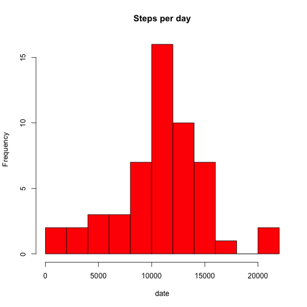
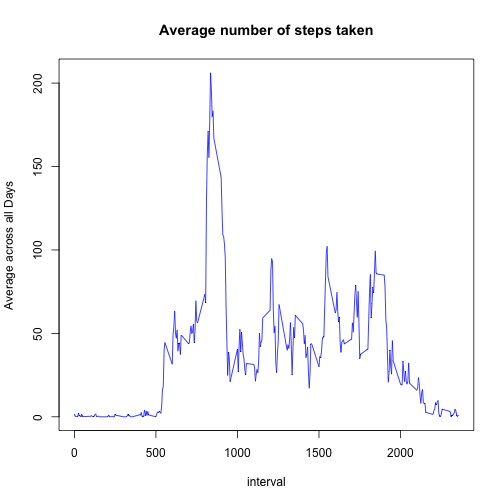
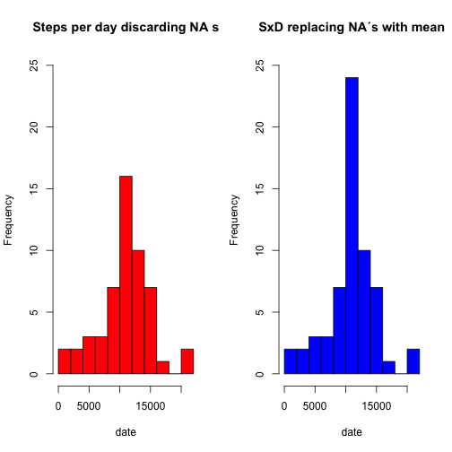
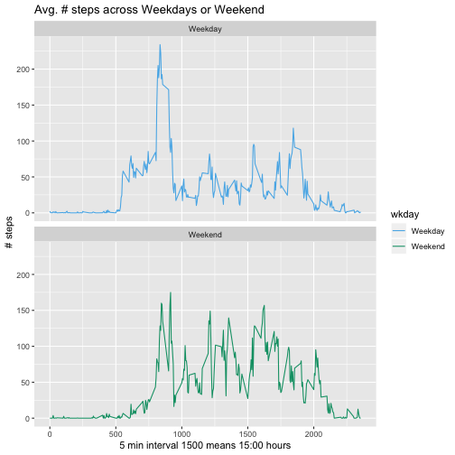

name:  "PA1_template.Rmd"

# Reproducible Research Peer Assigment 1


load packages


# 1. Loading and preprocessing the data

 Show any code that is needed to

  Load the data (i.e. 
  read.csv()
  Process/transform the data (if necessary) into a format suitable for your analysis


### 1.1 Load the data
First download the file to a directory within local computer
Tell R_studio to set working directory to that dir
Create working data tables to work with the data for each file 
 
The character "~" is the local root directory by default


```r
setwd("~/Documents/JOHN HOPKINS UNIV/MONTH 05 Reproducible Research/M05-Week02/Assignmt_Mo5_Week02")

myDataFrame <- read.csv("activity.csv", header=TRUE, stringsAsFactors=FALSE)
```


### 1.2 Process/transform the data (if necessary) into a format suitable for your analysis

omit NA`s and change to date string


```r
myDataFrame <- na.omit(myDataFrame) ## omit all records with NA´s 

myDataFrame$date <- as.Date(myDataFrame$date, format="%Y-%m-%d") ## convert field to date

head(myDataFrame)
```

```
##     steps       date interval
## 289     0 2012-10-02        0
## 290     0 2012-10-02        5
## 291     0 2012-10-02       10
## 292     0 2012-10-02       15
## 293     0 2012-10-02       20
## 294     0 2012-10-02       25
```

check its contents


```r
head(myDataFrame)
```

```
##     steps       date interval
## 289     0 2012-10-02        0
## 290     0 2012-10-02        5
## 291     0 2012-10-02       10
## 292     0 2012-10-02       15
## 293     0 2012-10-02       20
## 294     0 2012-10-02       25
```

```r
## check individual / unique items 
id_uniq_act <- sapply(myDataFrame, unique) ## way of checking the contents 
summary(id_uniq_act)
```

```
##          Length Class  Mode   
## steps    617    -none- numeric
## date      53    Date   numeric
## interval 288    -none- numeric
```

Now look at the values


```r
str(id_uniq_act)
```

```
## List of 3
##  $ steps   : int [1:617] 0 117 9 4 36 25 90 411 413 415 ...
##  $ date    : Date[1:53], format: "2012-10-02" "2012-10-03" ...
##  $ interval: int [1:288] 0 5 10 15 20 25 30 35 40 45 ...
```

There are two months ea. per day 61 days for months 10 and 11, 
 288 intervals (24 hours devided each by 12 intervals a 5 min ea.) and 618 steps
 Intervals jump from 55 to 100, 155 to 200 and thus represent hours , 955 is 9 hours 55min

# 2. What is the mean total number of steps taken per day?

For this part of the assignment, you can ignore the missing values in the dataset.

2.1 Calculate the total number of steps taken per day
2.2  Make a histogram of the total number of steps taken each day
2.3 Calculate and report the mean and median of the total number of steps taken per day
For this part of the assignment, you can ignore the missing values in the dataset.

Calculate the total number of steps taken per day
If you do not understand the difference between a histogram and a barplot, research the difference between them. Make a histogram of the total number of steps taken each day
Calculate and report the mean and median of the total number of steps taken per day

### 2.1 Calculate the total number of steps taken per day

Add all steps by day

```r
sumStepsxday <- aggregate(steps ~ date, myDataFrame, sum, na.rm = TRUE)
head(sumStepsxday,10)
```

```
##          date steps
## 1  2012-10-02   126
## 2  2012-10-03 11352
## 3  2012-10-04 12116
## 4  2012-10-05 13294
## 5  2012-10-06 15420
## 6  2012-10-07 11015
## 7  2012-10-09 12811
## 8  2012-10-10  9900
## 9  2012-10-11 10304
## 10 2012-10-12 17382
```

### 2.2  Make a histogram of the total number of steps taken each day

Histogram 

```r
hist(sumStepsxday$steps, main="Steps per day", xlab = "date", col="red", breaks=15)
```



### 2.3 Calculate and report the mean and median of the total number of steps taken per day

calculate mean and median

```r
    mean(sumStepsxday$steps) 
```

```
## [1] 10766.19
```

```r
    median(sumStepsxday$steps)
```

```
## [1] 10765
```

could have also done summary(sumStepsxday) shows these figures too


# 3. What is the average daily activity pattern?


### 3.1 Make a time series plot of 5-min interval (x-axis) + avg # steps

Make a time series plot (i.e. type = "l" type="l") 
of the 5-minute interval (x-axis) and the average number of steps taken, averaged across all days (y-axis)
Which 5-minute interval, on average across all the days in the dataset, contains the maximum number of steps?


calculate the mean steps by interval

create a data.frame to hold the number of steps aggregated by interval
plot on type="l" line graph


```r
sumStepsxinterval <- aggregate(steps ~ interval, myDataFrame, mean, na.rm = TRUE)

plot(sumStepsxinterval, type="l", ylab = "Average across all Days", main = "Average number of steps taken", col = "blue")
```




### 3.2 Which 5-minute interval, on average across all the days in the dataset, contains the maximum number of steps?


find out which is max interval from the summarized file

```r
max_interval_steps <- which.max(sumStepsxinterval$steps)

sumStepsxinterval[max_interval_steps,"interval"]
```

```
## [1] 835
```

could also do sumStepsxinterval[max_interval_steps, 1]  "[  ,1]" same as [ ,"interval"]


# 4. Imputing missing values

Note that there are a number of days/intervals where there are missing values (coded as 
NA
NA). The presence of missing days may introduce bias into some calculations or summaries of the data.

### 4.1 Calculate and report the total number of missing values in the dataset

(i.e. the total number of rows with NA NAs)


calculate the missing valuess


```r
## reload the data.frame to include NA´s that were excluded in previous excercises

myDataFrame <- read.csv("activity.csv", header=TRUE, stringsAsFactors=FALSE)


totalna_s <- sum(is.na(myDataFrame))

totalna_s
```

```
## [1] 2304
```

### 4.2 Devise a strategy for filling in all of the missing values in the dataset. 

The strategy does not need to be sophisticated. For example, you could use the mean/median for that day, or the mean for that 5-minute interval, etc.

Reload the data as is with NA's previously omitted the NA´s.

The strategy will be to use the mean by ea interval and fill the NA`s with this mean.

Use previous (see 3.1): "sumStepsxinterval" <- aggregate(steps ~ interval...) were summarized total steps per interval and create a newDataFrame merging the two files by interval. In other words put the mean of total steps by interval in ea interval.

Than create a new data.frame merging the two by interval and check its contents


```r
myDataFrame <- read.csv("activity.csv", header=TRUE, stringsAsFactors=FALSE)

newDataFrame <- merge(x=myDataFrame, y=sumStepsxinterval, by="interval")

head(newDataFrame)
```

```
##   interval steps.x       date  steps.y
## 1        0      NA 2012-10-01 1.716981
## 2        0       0 2012-11-23 1.716981
## 3        0       0 2012-10-28 1.716981
## 4        0       0 2012-11-06 1.716981
## 5        0       0 2012-11-24 1.716981
## 6        0       0 2012-11-15 1.716981
```


### 4.3 Create a new dataset that is equal to the original dataset but with the missing data filled in.

Within the new file check if field "Steps.x" (myDataFrame original) is NA,  than replace the NA values with the mean for that 5-minute interval stored now in "Steps.y"(sumStepsxinterval) if "$steps.x" is NA then put the value of "$Steps.y", else put the value of "$Steps.x" 

Check and see (head) that effectively replaced the NA's with the interval mean stored in "Steps.y"


```r
newDataFrame$steps <- ifelse(is.na(newDataFrame$steps.x), newDataFrame$steps.y, newDataFrame$steps.x)
head(newDataFrame)
```

```
##   interval steps.x       date  steps.y    steps
## 1        0      NA 2012-10-01 1.716981 1.716981
## 2        0       0 2012-11-23 1.716981 0.000000
## 3        0       0 2012-10-28 1.716981 0.000000
## 4        0       0 2012-11-06 1.716981 0.000000
## 5        0       0 2012-11-24 1.716981 0.000000
## 6        0       0 2012-11-15 1.716981 0.000000
```

     

### 4.4 Make a histogram of the total number of steps taken each day 
 and Calculate and report the mean and median total number of steps taken per day. Do these values differ from the estimates from the first part of the assignment? What is the impact of imputing missing data on the estimates of the total daily number of steps?

Plot the two hist side by side with par function to compare

Aggregate by day (== date) for original file as done in previous excercise 

and Aggregate new file with NA's replaced


```r
sumStepsxday <- aggregate(steps ~ date, myDataFrame, sum, na.rm = TRUE)

head(sumStepsxday,10)
```

```
##          date steps
## 1  2012-10-02   126
## 2  2012-10-03 11352
## 3  2012-10-04 12116
## 4  2012-10-05 13294
## 5  2012-10-06 15420
## 6  2012-10-07 11015
## 7  2012-10-09 12811
## 8  2012-10-10  9900
## 9  2012-10-11 10304
## 10 2012-10-12 17382
```

```r
newStepsxday <- aggregate(steps ~ date, newDataFrame, sum, na.rm = TRUE)

head(newStepsxday,10)
```

```
##          date    steps
## 1  2012-10-01 10766.19
## 2  2012-10-02   126.00
## 3  2012-10-03 11352.00
## 4  2012-10-04 12116.00
## 5  2012-10-05 13294.00
## 6  2012-10-06 15420.00
## 7  2012-10-07 11015.00
## 8  2012-10-08 10766.19
## 9  2012-10-09 12811.00
## 10 2012-10-10  9900.00
```


Plot using par 1,2 side by side one row to columns
and reset panel par() to 1,1


```r
par(mfrow=c(1,2))

hist(sumStepsxday$steps, main="Steps per day discarding NA s", xlab = "date", col="red", breaks=15, ylim = c(0,25))  ## put the limit at 25 for easy graph comparison/read

hist(newStepsxday$steps, main="SxD replacing NA´s with mean", xlab = "date", col="blue", breaks=15, ylim = c(0,25))
```



```r
par(mfrow=c(1,1)) ## reset the panel
```


test median of ea file


```r
mean(sumStepsxday$steps)  ## Original file mean
```

```
## [1] 10766.19
```

```r
median(sumStepsxday$steps) ## Original file median
```

```
## [1] 10765
```

```r
mean(newStepsxday$steps)   ## New file mean - NA´s converted to mean
```

```
## [1] 10766.19
```

```r
median(newStepsxday$steps)  ## New file median - NA´s converted to mean
```

```
## [1] 10766.19
```


The only difference is in the median because the median is a number that must exist.  In the original datafile the num 10766.19 does not exist. On the other hand, in the newly created datafile it does exist.(It was forced in).  This can be tested via the eg. the "length" rcomand to see if it effectively exists use round with 2 decimals because it maybe stored with more decimals.


```r
length(which(round(sumStepsxday$steps, digits=2) == 10766.19)) ## Original
```

```
## [1] 0
```

```r
length(which(round(newStepsxday$steps, digits=2) == 10766.19)) ## New
```

```
## [1] 8
```

It can be seen that in the original file it does not exist,  whereas in the new file it does actually exist in 8 cases for this interval. (looks like 8 days had missing data thus where filled with NA´s and were replaced with the mean(interval) value)


# 5. Are there differences in activity patterns between weekdays and weekends?

For this part the  weekdays() function may be of some help here. Use the dataset with the filled-in missing values for this part.


### 5.1 Create a new factor variable in the dataset with two levels 
– “weekday” and “weekend” indicating whether a given date is a weekday or weekend day.

Create a new file to hold all days of week and weekdays vs weekends. 


```r
## first copy the data.frame

daysDataFrame<- data.frame(myDataFrame)

## (omit NA´s)
daysDataFrame <- na.omit(daysDataFrame)

## (convert to date field )
daysDataFrame$date <- as.Date(daysDataFrame$date, format="%Y-%m-%d")

## insert a new field with the name of the weekday
daysDataFrame$days <- weekdays(daysDataFrame$date)

## insert another field "Weekday" or "Weekend" depending on day

daysDataFrame$wkday <- ifelse(daysDataFrame$days=="Saturday" | daysDataFrame$days =="Sunday", "Weekend", "Weekday")

## check with length function to see if done Ok OPTIONAL
## should match ok
## length(which(daysDataFrame$days == "Sunday" | daysDataFrame$days == "Saturday"))
## length(which(daysDataFrame$wkday == "Weekend" ))

head(daysDataFrame)  ## to see how new file looks like
```

```
##     steps       date interval    days   wkday
## 289     0 2012-10-02        0 Tuesday Weekday
## 290     0 2012-10-02        5 Tuesday Weekday
## 291     0 2012-10-02       10 Tuesday Weekday
## 292     0 2012-10-02       15 Tuesday Weekday
## 293     0 2012-10-02       20 Tuesday Weekday
## 294     0 2012-10-02       25 Tuesday Weekday
```

### 5.2 Make a panel plot containing a time series plot 

(i.e.type="l") of the 5-minute interval (x-axis) and the average number of steps taken, averaged across all weekday days or weekend days (y-axis). See the README file in the GitHub repository to see an example of what this plot should look like using simulated data.

plot()


```r
## first aggreagte steps by interval for file with weekdays 
##     include +wkday to treat Weekends and Weekdays function mean

sumStepsxintWkd<-aggregate(steps~interval+wkday,data=daysDataFrame,mean)

## check it should be length 288 x 2 (one for Weekdays one for Weekends)
str(sumStepsxintWkd)
```

```
## 'data.frame':	576 obs. of  3 variables:
##  $ interval: int  0 5 10 15 20 25 30 35 40 45 ...
##  $ wkday   : chr  "Weekday" "Weekday" "Weekday" "Weekday" ...
##  $ steps   : num  2.333 0.462 0.179 0.205 0.103 ...
```

```r
## used a predefined color for the line in the graph
manual_color2 <- c("#56B4E9", "#009E73", "#F0E442") 


## now plot with the summarized file by interval and weekday/end

ggplot(sumStepsxintWkd , aes(x = interval, y = steps, color=`wkday`)) + 
  geom_line() + 
  labs(title = "Avg. # steps across Weekdays or Weekend ", x = "5 min interval 1500 means 15:00 hours", y = "# steps") + 
  scale_color_manual(values = manual_color2) +  ## use color scheme stored in var "manual_color2"
  facet_wrap(~`wkday` , ncol = 1, nrow=2)  ## two panels one in each row
```



#### "It looks like people do more steps in the weekends with the exception of around 9 am that peaks more on the weekdays!"


OPTIONAL: Some other colors for the plot use some predefined manual 

manual_color1 <- c("#00AFBB", "#E7B800", "#FC4E07") 
manual_color2 <- c("#56B4E9", "#009E73", "#F0E442") 
manual_color3 <- c("#E69F00", "#56B4E9", "#009E73") 
manual_color4 <- c("#000000", "#E69F00", "#56B4E9") 
manual_color5 <- c("#000000", "#00AFBB", "#56B4E9") 

